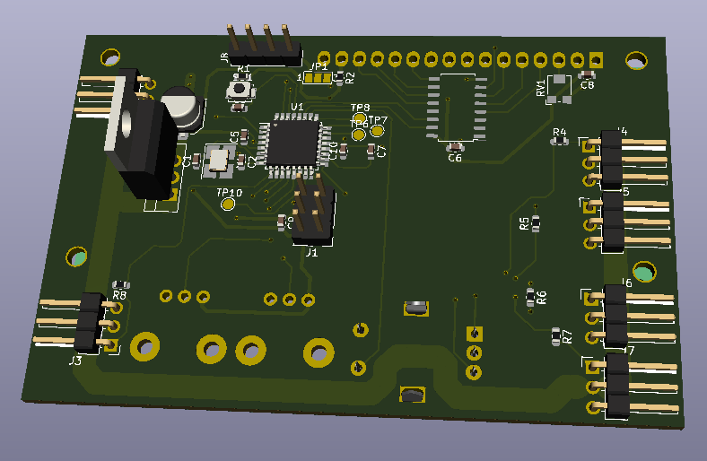

# Servotester with ATmega328

Little Hardware and Software to test Servos.





Documentation can be found in subdir **"docs"** and can be build with

```sh
mkdocs serve
```

in a terminal window. After that it can be viewed via browser from URL `http://localhost:8000/` .